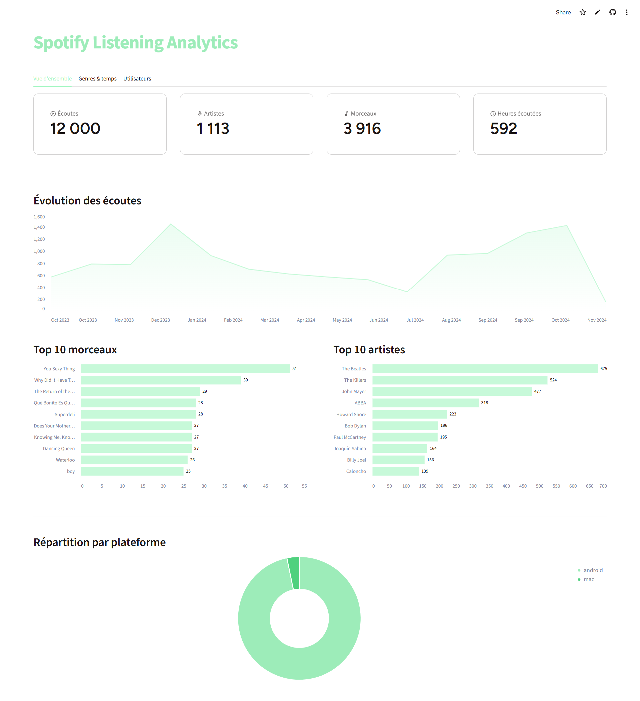

# Spotify Listening Analytics — MongoDB

NoSQL mini-project (MGO-6). Modeling and analyzing a Spotify listening history with MongoDB.

**Live dashboard:** https://spotify-listening-analytics-app.streamlit.app

Master Informatique et Télécommunications, Université Mohammed V de Rabat.
By Chaymae Benrhanem and Chakir El Amrani.

## Context

A music streaming platform wants to understand how its users listen: which artists are popular, which genres dominate, and when activity peaks.

## Dataset

[Spotify Streaming History](https://www.kaggle.com/) from Kaggle. 149,860 listening events between 2013 and 2024. One row is one listening event, not one track.

The dataset had three gaps, and each one required a decision:

| Problem | Decision |
|---|---|
| 149,860 rows, but the brief asks for 8,000 to 15,000 | Kept the 12,000 most recent listens, over a continuous period |
| No genre column, but two required analyses need it | Enriched with the Last.fm API (artist tags). 96.7% coverage |
| No user column: the data belongs to a single person | Simulated 16 users by splitting the timeline into chunks |

The user simulation is an accepted limitation. Each user only exists during one time window, so per-user time analyses reflect the split, not real behavior. Global analyses are still valid.

## Data model

Two collections:

- **`ecoutes`** — one document per listening event. The track (`morceau`) is **embedded**: a listen is a frozen historical record, always read together with its track metadata. No join needed.
- **`utilisateurs`** — user profiles. Referenced from `ecoutes` via `id_utilisateur`, because user data is shared and read separately.

```json
{
  "_id": "eco_00001",
  "id_utilisateur": "user_01",
  "spotify_track_uri": "6BnY0YochAURSXSR3d5N7O",
  "morceau": {
    "titre": "Andy, You're A Star",
    "artiste": "The Killers",
    "album": "Hot Fuss",
    "genre": "indie"
  },
  "plateforme": "android",
  "ms_played": 194080,
  "shuffle": true,
  "skipped": false,
  "date_ecoute": { "$date": "2023-10-05T03:08:51Z" }
}
```

Embedding makes reads fast but duplicates metadata: fixing one track's genre updates N documents (`updateMany`). That cost is acceptable here, since a listen is never corrected after the fact.

## Pipeline

Seven scripts, run in order. Each one reads the previous output and writes a new file, so any step can be replayed.

| # | Script | Role |
|---|---|---|
| 1 | `explore.py` | Stats on the raw dataset |
| 2 | `sample.py` | Reduce to 12,000 listens |
| 3 | `fetch_tags.py` | Fetch artist tags from Last.fm (cached) |
| 4 | `build_categories.py` | Count tags to build the genre whitelist |
| 5 | `map_genres.py` | Map each artist to one genre |
| 6 | `build_documents.py` | Build the final JSON documents |
| 7 | `import_mongodb.py` | Load into MongoDB |

## Queries

| File | Content |
|---|---|
| `queries/crud.js` | Create, read, update, delete |
| `queries/analyses.js` | 8 aggregation pipelines |
| `queries/indexation.js` | Index creation and `explain()` comparison |

## Indexing

Indexes on `morceau.artiste`, `date_ecoute`, `id_utilisateur`, `morceau.genre`.

Measured on a search by artist:

| | Before | After |
|---|---|---|
| Stage | COLLSCAN | IXSCAN + FETCH |
| Documents examined | 12,000 | 524 |
| Documents returned | 524 | 524 |

Without the index, MongoDB reads every document to keep 524. With it, it reads only the 524 it needs.

## Dashboard

A Streamlit app displays the analyses as charts. `dashboard/mongo_queries.py` holds the aggregation pipelines, `dashboard/app.py` holds the display.



## Setup

```bash
python -m venv venv
source venv/bin/activate
pip install -r requirements.txt

cp .env.example .env   # fill in MONGO_URI

docker run -d --name mongo -p 27017:27017 mongo:7
python scripts/import_mongodb.py
```

Expected output:

```
ecoutes: 12000
utilisateurs: 16
```

Then open the MongoDB shell:

```bash
docker exec -it mongo mongosh streaming
```

Or run the dashboard:

```bash
streamlit run dashboard/app.py
```

## Notes

- Raw data (`data/raw/`) is not versioned. Download it from Kaggle and place it there.
- `fetch_tags.py` needs a Last.fm API key in `.env`. It caches results, so the API is called once per artist.
- `import_mongodb.py` is idempotent: it clears the collections before inserting, so it can be replayed safely.
- Dates use Extended JSON (`{"$date": ...}`) and are decoded with `bson.json_util`, so MongoDB stores real `Date` objects.

## License

MIT